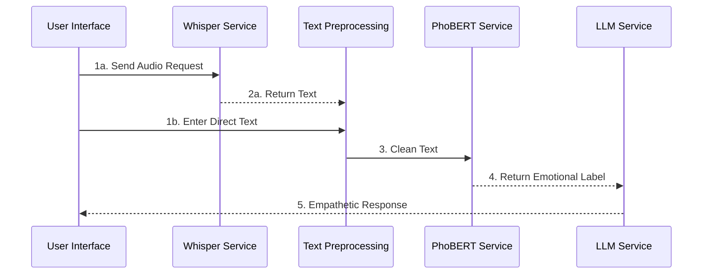

# AI Mental Health Assistant — Hệ thống tư vấn tâm lý tiếng Việt đa phương thức

Capstone Project SP26AI69 — Hệ thống AI hiểu cảm xúc và sinh phản hồi đồng cảm (Multimodal Emotion Understanding & Empathetic Response Generation System) phục vụ tư vấn tâm lý bằng tiếng Việt.

> Repo: [capstone-project-SP26AI69-sourcecode-final](https://github.com/huyhoang20451/capstone-project-SP26AI69-sourcecode-final)

---

## 1. Ý tưởng của đề tài

Sức khỏe tinh thần là một nhu cầu ngày càng lớn tại Việt Nam, trong khi các giải pháp tư vấn tâm lý bằng AI hiện có gần như chỉ hỗ trợ tiếng Anh và xử lý một chiều dữ liệu (chỉ văn bản hoặc chỉ giọng nói). Nhóm xây dựng một **trợ lý tư vấn tâm lý tiếng Việt**, có khả năng:

- Tiếp nhận đầu vào **đa phương thức**: giọng nói (speech) hoặc văn bản (text).
- **Hiểu cảm xúc** của người dùng ở mức chi tiết (không chỉ tích cực/tiêu cực mà còn phân loại theo nhiều sắc thái cảm xúc cụ thể).
- **Sinh phản hồi đồng cảm (empathetic response)** phù hợp với trạng thái cảm xúc và ngữ cảnh hội thoại, thay vì trả lời chung chung.

Mục tiêu là tạo ra một hệ thống đóng vai trò "người lắng nghe" ban đầu, hỗ trợ người dùng giãi bày và nhận được phản hồi mang tính thấu cảm, trước khi cần đến chuyên gia tâm lý thật sự.

## 2. Những nghiên cứu trước đây

Nhóm khảo sát các hướng nghiên cứu liên quan: hội thoại đồng cảm bằng giọng nói (BLSP-Emo), hội thoại đồng cảm bằng văn bản (Gao et al.), và hỗ trợ sức khỏe tâm thần trực tuyến (Sharma et al.). Phần lớn các công trình này chỉ hỗ trợ tiếng Anh và xử lý đơn phương thức (chỉ speech hoặc chỉ text), trong khi hệ thống của nhóm hướng tới tiếng Việt và kết hợp cả hai phương thức đầu vào.


## 3. Giải pháp để giải quyết bài toán của nhóm

Từ những hạn chế trên, nhóm đề xuất giải pháp:

- **Bộ ngữ liệu tự thu thập bằng tiếng Việt** cho bài toán tư vấn tâm lý, thay vì dùng lại các bộ dữ liệu tiếng Anh (Empathetic Dialogues, TalkLife...).
- **Pipeline đa phương thức**: cho phép người dùng nhập bằng giọng nói (qua mô-đun Speech-to-Text) hoặc trực tiếp bằng văn bản, hội tụ về cùng một luồng xử lý.
- **Nhận diện cảm xúc phân cấp (hierarchical)**: kết hợp giữa mô hình PhoBERT đa nhiệm (multitask) và mô hình Machine Learning truyền thống, phân loại theo 2 tầng — cảm xúc nhóm lớn (coarse) rồi đến cảm xúc chi tiết (fine-grained) — để vừa đảm bảo độ chính xác vừa có thể fallback khi cần.
- **LLM được fine-tune riêng cho tiếng Việt** (Qwen2.5-1.5B) để sinh phản hồi tư vấn vừa đúng ngữ cảnh, vừa thể hiện sự đồng cảm, được triển khai cục bộ qua llama.cpp để chủ động về chi phí và quyền riêng tư dữ liệu nhạy cảm.
- **Đối chiếu độ nhất quán cảm xúc**: so sánh nhãn cảm xúc do LLM tự nhận định với nhãn từ mô hình PhoBERT/ML bằng cosine similarity trên embedding, giúp tăng độ tin cậy của hệ thống.

## 4. Kiến trúc của mô hình

Hệ thống gồm các thành phần chính:

| Thành phần | Vai trò | Công nghệ |
|---|---|---|
| **Speech-to-Text** | Chuyển giọng nói tiếng Việt thành văn bản | Whisper-small fine-tune tiếng Việt |
| **Text Preprocessing** | Chuẩn hóa văn bản (teencode, tách từ...) | `underthesea` |
| **Emotion Understanding** | Phân loại cảm xúc 2 tầng: nhóm lớn (coarse) → chi tiết (fine-grained) | PhoBERT đa nhiệm (multitask) **hoặc** mô hình ML phân cấp (Logistic Regression/XGBoost theo từng "chuyên gia" cảm xúc) trên embedding `vietnamese-sbert` |
| **Empathetic Response Generation** | Sinh phản hồi tư vấn đồng cảm, có kèm nhãn cảm xúc | Qwen2.5-1.5B (fine-tuned), phục vụ qua `llama-server` (llama.cpp) |
| **Đối chiếu cảm xúc** | Tính độ tương đồng giữa nhãn cảm xúc của LLM và của mô hình phân loại | Cosine similarity trên embedding `vietnamese-sbert` |
| **Lưu trữ hội thoại** | Lưu lịch sử chat theo từng cuộc hội thoại | SQLAlchemy (PostgreSQL/SQLite) |

Ứng dụng có 2 chế độ giao diện: bản đầy đủ chạy bằng **FastAPI** (`app/main.py`) và bản rút gọn chạy bằng **Gradio** (`app.py`, phù hợp demo nhanh/Hugging Face Spaces).

## 5. Sơ đồ hệ thống



Luồng xử lý: người dùng nhập **giọng nói** (qua Whisper Service) hoặc **văn bản trực tiếp**, cả hai đều hội tụ tại bước **Text Preprocessing**. Văn bản sạch được đưa vào **PhoBERT Service** để trả về nhãn cảm xúc, sau đó nhãn cảm xúc cùng văn bản được gửi đến **LLM Service** để sinh ra phản hồi đồng cảm, trả ngược về giao diện người dùng.

## 6. Cách chạy dự án

### Bước 1 — Clone mã nguồn

```bash
git clone https://github.com/huyhoang20451/capstone-project-SP26AI69-sourcecode-final.git
```

### Bước 2 — Trỏ tới folder mã nguồn

```bash
cd capstone-project-SP26AI69-sourcecode-final
python -m venv venv
source venv/bin/activate        # Windows: venv\Scripts\activate
pip install -r requirements.txt
```

### Bước 3 — Setup llama.cpp (phục vụ LLM Service)

Hệ thống gọi LLM thông qua HTTP API tương thích OpenAI của `llama-server` (mặc định tại `http://localhost:8080`), nên cần build llama.cpp và chạy server với model Qwen2.5-1.5B đã fine-tune dạng GGUF:

```bash
# 1. Clone và build llama.cpp
git clone https://github.com/ggml-org/llama.cpp.git
cd llama.cpp
cmake -B build              # thêm -DGGML_CUDA=ON nếu máy có GPU NVIDIA
cmake --build build --config Release -j

# 2. Chạy llama-server với model đã fine-tune (thay đường dẫn .gguf bằng file thật của bạn)
./build/bin/llama-server \
  -m /duong-dan/toi/qwen2.5-1.5b-chat-tamly-markdown-withemotion.gguf \
  --alias qwen2.5-1.5b-chat-tamly-markdown-withemotion:latest \
  --port 8080 \
  -c 4096
```

> Lưu ý: tên `--alias` cần khớp với biến `DEFAULT_LLM_MODEL` trong `app/config.py` (mặc định là `qwen2.5-1.5b-chat-tamly-markdown-withemotion:latest`). Nếu dùng model/tên khác, có thể override bằng biến môi trường `DEFAULT_LLM_MODEL` và `LLAMA_SERVER_BASE_URL`.

### Bước 4 — Chạy dự án local

Quay lại thư mục gốc của repo (giữ `llama-server` đang chạy ở terminal khác), sau đó:

```bash
# Bản đầy đủ (FastAPI)
uvicorn app.main:app --reload --port 8000
# Truy cập: http://localhost:8000

# Hoặc bản rút gọn (Gradio)
python app.py
```

#### Một số biến môi trường cần lưu ý

| Biến | Ý nghĩa | Mặc định |
|---|---|---|
| `LLAMA_SERVER_BASE_URL` | Địa chỉ `llama-server` | `http://localhost:8080` |
| `DEFAULT_LLM_MODEL` | Tên/alias model LLM | `qwen2.5-1.5b-chat-tamly-markdown-withemotion:latest` |
| `WHISPER_LOCAL_MODEL_DIR` | Thư mục weight Whisper fine-tune (local) | tự dò trong `app/services/whisper_service.py` |
| `PHOBERT_MULTITASK_MODEL_PATH` | Thư mục checkpoint PhoBERT đa nhiệm | `checkpoint-3824.../checkpoint-3824` |
| `DATABASE_URL` | Chuỗi kết nối CSDL | PostgreSQL (FastAPI) / SQLite (Gradio) |

---

*Đồ án tốt nghiệp — FPT University.*
