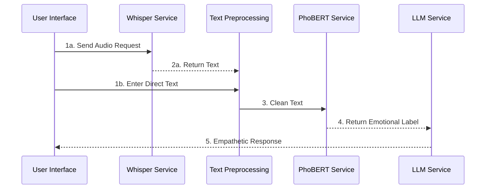

# AI Mental Health Assistant — A Multimodal Vietnamese Psychological Counseling System

Capstone Project SP26AI69 — Multimodal Emotion Understanding & Empathetic Response Generation System for psychological counseling in Vietnamese.

> Repo: [empathetic-counselling-a.i](https://github.com/huyhoang20451/empathetic-counselling-a.i)

---

## 1. Project Idea

Mental health support is a rapidly growing necessity in Vietnam. However, existing AI-powered psychological counseling solutions predominantly support English and handle data uni-directionally (either text-only or speech-only). This project builds a **Vietnamese psychological counseling assistant** capable of:

- Accepting **multimodal** inputs: speech or text.
- **Understanding emotions** at a fine-grained level (classifying specific emotional nuances rather than just broad positive/negative sentiments).
- **Generating empathetic responses** tailored to the user's emotional state and conversational context, avoiding generic or robotic replies.

The primary goal is to create an initial "listening" framework that helps users express themselves and receive empathetic feedback before transitioning to human professionals when necessary.

## 2. Related Work

The team reviewed relevant research domains: speech-based empathetic conversation (BLSP-Emo), text-based empathetic conversation (Gao et al.), and online mental health support (Sharma et al.). Most of these frameworks are tailored exclusively for English and utilize unimodal processing (either speech or text), whereas this project targets the Vietnamese language and seamlessly integrates both input modalities.


## 3. Our Solution

To address the limitations of prior works, the team proposes the following solutions:

- **Self-collected Vietnamese Dataset**: Specially curated for psychological counseling context, shifting away from generic English datasets (Empathetic Dialogues, TalkLife, etc.).
- **Multimodal Pipeline**: Allows users to input via speech (through a Speech-to-Text module) or directly via text, converging into a unified processing flow.
- **Hierarchical Emotion Recognition**: Combines a multi-task PhoBERT model with traditional Machine Learning models, classifying emotions across 2 tiers—coarse-grained categories followed by fine-grained labels—ensuring accuracy while allowing for fallback mechanisms if needed.
- **Fine-tuned Vietnamese LLM** (Qwen2.5-1.5B): Tailored specifically to generate responses that are contextually accurate and highly empathetic. It is deployed locally via llama.cpp to ensure complete control over costs and strict data privacy for sensitive user information.
- **Emotion Consistency Check**: Evaluates consistency between the emotion label determined by the LLM and the label predicted by the PhoBERT/ML classification models using cosine similarity on embeddings, enhancing overall system reliability.

## 4. System Architecture

The core architecture consists of the following components:

| Component | Role | Technology Used |
|---|---|---|
| **Speech-to-Text** | Converts Vietnamese speech into text | Fine-tuned Whisper-small (Vietnamese) |
| **Text Preprocessing** | Standardizes text (resolves teencode, performs word segmentation, etc.) | `underthesea` |
| **Emotion Understanding** | Classifies emotions in 2 tiers: coarse-grained → fine-grained | Multi-task PhoBERT **OR** Hierarchical ML models (Logistic Regression/XGBoost per emotion "expert") built on `vietnamese-sbert` embeddings |
| **Empathetic Response Generation** | Generates empathetic counseling responses accompanied by emotion tags | Fine-tuned Qwen2.5-1.5B, served via `llama-server` (llama.cpp) |
| **Emotion Consistency Check** | Computes similarity scores between the LLM's determined emotion and the classifier's predicted emotion | Cosine similarity on `vietnamese-sbert` embeddings |
| **Conversation Storage** | Logs and manages chat history broken down by session | SQLAlchemy (PostgreSQL/SQLite) |

The application features two interface modes: a full-featured version running on **FastAPI** (`app/main.py`) and a lightweight version powered by **Gradio** (`app.py`, ideal for quick demonstrations or hosting on Hugging Face Spaces).

## 5. System Sequence Diagram



## 6. Getting Started
 
> **Two ways to run this project:**
> | Mode | Entry point | Best for |
> |---|---|---|
> | **FastAPI** (full-featured) | `app/main.py` | Local development, production |
> | **Gradio** (lightweight) | `app.py` | Quick demo, Hugging Face Spaces |
>
> ⚠️ **Note:** The fine-tuned Whisper model (Vietnamese STT) **cannot be loaded on Hugging Face Spaces** due to resource constraints. Speech-to-Text is only available when running **locally**. The Gradio mode on HF Spaces will fall back to text-only input.
 
---
 
### Prerequisites
 
| Requirement | Version |
|---|---|
| Python | ≥ 3.10 |
| [llama.cpp](https://github.com/ggerganov/llama.cpp) (`llama-server`) | Latest release |
| CUDA Toolkit *(optional, for GPU)* | ≥ 11.8 |
| Git | Any recent version |
 
---
 
### Step 1 — Clone the Repository
 
```bash
git clone https://github.com/huyhoang20451/empathetic-counselling-a.i.git
cd empathetic-counselling-a.i
```
 
---
 
### Step 2 — Set Up Python Environment
 
```bash
python -m venv venv
 
# Windows
venv\Scripts\activate
 
# macOS / Linux
source venv/bin/activate
 
pip install -r requirements.txt
```
 
> If you plan to use GPU acceleration for Whisper or PhoBERT, also install the appropriate `torch` version from [pytorch.org](https://pytorch.org/get-started/locally/).
 
---
 
### Step 3 — Download the Fine-tuned Whisper Model (Local STT)
 
The Vietnamese fine-tuned Whisper model is **not bundled** in this repository. You must download it manually.
 
📥 **Download link:** [Google Drive — whisper\_vi\_final\_model](https://drive.google.com/drive/folders/1d__P6ijS2F-Tw_Fv7p3js1sCgEVE0yNG)
 
After downloading, extract the folder so the structure looks like this:
 
```
empathetic-counselling-a.i/
├── whisper_vi_final_model/       ← place it here (recommended)
│   ├── config.json
│   ├── model.safetensors
│   ├── preprocessor_config.json
│   ├── tokenizer.json
│   └── ...
├── app/
├── app.py
└── requirements.txt
```
 
> Alternatively, place the folder anywhere and set the environment variable:
> ```bash
> # Windows
> set WHISPER_LOCAL_MODEL_DIR=C:\path\to\whisper_vi_final_model
>
> # macOS / Linux
> export WHISPER_LOCAL_MODEL_DIR=/path/to/whisper_vi_final_model
> ```
 
---
 
### Step 4 — Start the LLM Backend (`llama-server`)
 
This project uses **llama.cpp** to serve the fine-tuned Qwen2.5-1.5B model locally. Make sure `llama-server` is installed and the GGUF model file is available.
 
```bash
llama-server \
  --model path/to/qwen2.5-1.5b-chat-tamly.gguf \
  --host 127.0.0.1 \
  --port 8080 \
  --ctx-size 4096
```
 
> The server must be running **before** launching the application. By default, the app expects it at `http://localhost:8080`. Override with:
> ```bash
> export LLAMA_SERVER_BASE_URL=http://localhost:8080
> ```
 
---
 
### Step 5 — Configure Environment Variables *(optional)*
 
Create a `.env` file in the project root, or export these variables directly:
 
```env
# LLM backend URL (default: http://localhost:8080)
LLAMA_SERVER_BASE_URL=http://localhost:8080
 
# Default LLM model name as returned by llama-server
DEFAULT_LLM_MODEL=qwen2.5-1.5b-chat-tamly-markdown-withemotion:latest
 
# Path to local Whisper model directory (if not placed in project root)
WHISPER_LOCAL_MODEL_DIR=./whisper_vi_final_model
 
# Database URL — defaults to SQLite for local dev, change to Postgres for production
DATABASE_URL=sqlite:///./web_emotion_chat.db
```
 
---
 
### Step 6A — Run (FastAPI — Full Featured)
 
```bash
uvicorn app.main:app --host 127.0.0.1 --port 8000 --reload
```
 
Then open: [http://127.0.0.1:8000](http://127.0.0.1:8000)
 
---
 
### Step 6B — Run (Gradio — Lightweight Demo)
 
```bash
python app.py
```
 
Gradio will print a local URL (e.g. `http://127.0.0.1:7860`) and optionally a public share link.
 
> On **Hugging Face Spaces**, the app runs in Gradio mode automatically. Whisper STT is disabled in this environment — users interact via text input only.
 
---
 
### Troubleshooting
 
| Problem | Likely Cause | Fix |
|---|---|---|
| `FileNotFoundError: whisper_vi_final_model` | Whisper folder not found | Check `WHISPER_LOCAL_MODEL_DIR` points to the correct path |
| `Connection refused` on LLM calls | `llama-server` not running | Start the server first (Step 4) |
| `ModuleNotFoundError: underthesea` | Missing dependency | Run `pip install -r requirements.txt` again |
| Slow inference on CPU | No GPU / CUDA | Expected — CPU inference is slower; GPU recommended for real-time use |
| Gradio won't load on HF Spaces | Whisper init fails | Ensure `WHISPER_LOCAL_MODEL_DIR` env var is **not** set on Spaces |
